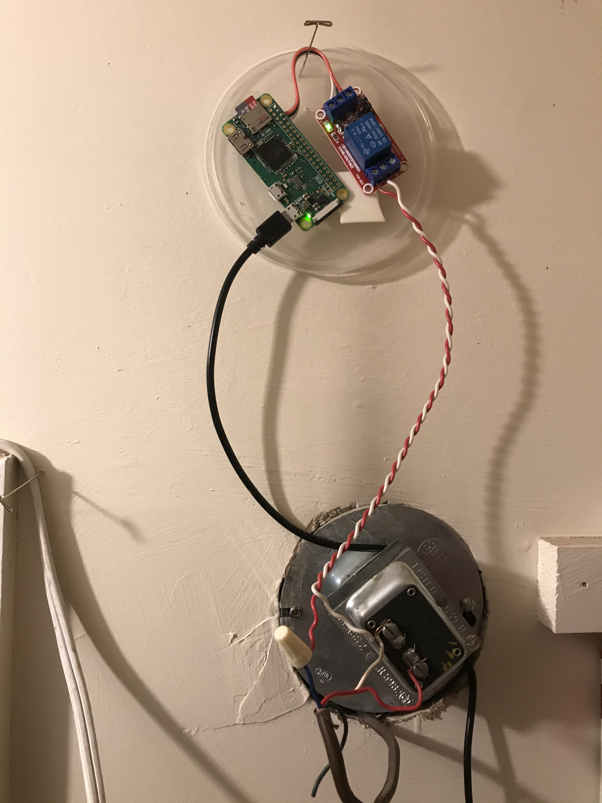
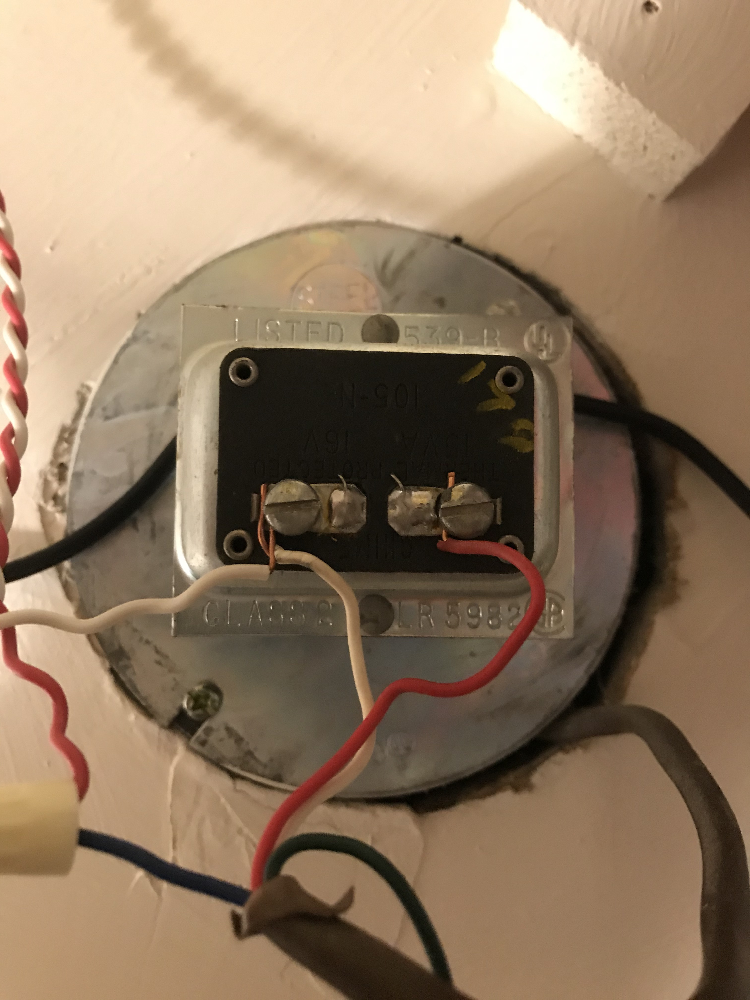
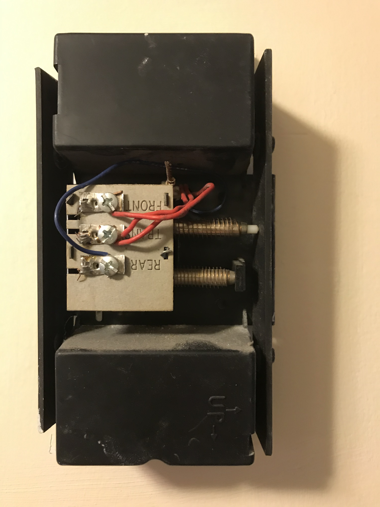

# rpi_bellschedule
Raspberry Pi Door Bell Schedule


I hooked a Raspberry Pi Zero W to my doorbell to enable an automated bell schedule during COVID home schooling. During COVID home schooloing it is really easy to lose track of time.  The bell schedule in physical school gives good opportunities to swithc gears and move around, something that we've been having a hard time managing at home.  

[](https://drf5n.github.io/rpi_bellschedule/wiring.jpg)

This project snapped together in two hours for less than $15 using these parts:

* Raspberry Pi Zero W ([Adafruit $10](https://www.adafruit.com/product/3400))
* Relay module with a 5v coil, optoisolated ([Amazon $15 for a 10 pack](https://www.amazon.com/gp/product/B07WQH63FB))
* Mini USB power adapter (junk box)

After I booted up the headless RPi on the home network, (per https://levelup.gitconnected.com/headless-installation-of-raspberry-pi-using-noobs-and-make-it-ready-for-ssh-ad9a94babd85) I made sure I had cron and at: 

    sudo apt install cron apt 

I then wrote a script to ring the bell: https://github.com/drf5n/rpi_bellschedule/blob/main/twiddle.py

After the script seemed to function, I wired up the relay to the RPi Zero, with the GPIO14 delivering the IN to the relay module, and jumpering the +5 and GND from the board.  

[](https://drf5n.github.io/rpi_bellschedule/RPi_relay.jpg)

I tested the script a bit to watch the light on the relay operate, feel the click of the relay, and to use a DMM on the output terminals to make sure I wasn’t accidently using some inverse logic.

Then I started wiring it up to the bell.

Fortunately, the bell for the doorbell was conveniently connected with a 4-conductor cable with two unused leads, so I co-opted the unused green wire for the connection from the transformer in my pantry to the “REAR” connection on the bell:

[](https://drf5n.github.io/rpi_bellschedule/transformer.jpg)
[](https://drf5n.github.io/rpi_bellschedule/doorbell.jpg)

Then I could setup a crontab to call my script at times corresponding to the bell schedule:

```
# m h  dom mon dow   command

#* * * * * 2021/twiddle.py --pulses 10 --on 50 --delay 50

30 6-23 * * * 2021/twiddle.py --pulses 1 --on 25 --delay 100
0 7 * * * 2021/twiddle.py --pulses 7 --on 25 --delay 1000
0 8 * * * 2021/twiddle.py --pulses 8 --on 25 --delay 1000
0 9 * * * 2021/twiddle.py --pulses 9 --on 25 --delay 1000
0 10 * * * 2021/twiddle.py --pulses 10 --on 25 --delay 1000
0 11 * * * 2021/twiddle.py --pulses 11 --on 25 --delay 1000
0 12 * * * 2021/twiddle.py --pulses 12 --on 25 --delay 1000
0 13 * * * 2021/twiddle.py --pulses 1 --on 25 --delay 1000
0 14 * * * 2021/twiddle.py --pulses 2 --on 25 --delay 1000
0 15 * * * 2021/twiddle.py --pulses 3 --on 25 --delay 1000
0 16 * * * 2021/twiddle.py --pulses 4 --on 25 --delay 1000
0 17 * * * 2021/twiddle.py --pulses 5 --on 25 --delay 1000
0 18 * * * 2021/twiddle.py --pulses 6 --on 25 --delay 1000
0 19 * * * 2021/twiddle.py --pulses 7 --on 25 --delay 1000
0 20 * * * 2021/twiddle.py --pulses 8 --on 25 --delay 1000
0 21 * * * 2021/twiddle.py --pulses 9 --on 25 --delay 1000
0 22 * * * 2021/twiddle.py --pulses 10 --on 25 --delay 1000
0 23 * * * 2021/twiddle.py --pulses 11 --on 25 --delay 1000
0 0 * * * 2021/twiddle.py --pulses 12 --on 25 --delay 1000

# dinnertime
55 17 * * * 2021/twiddle.py --pulses 6 --on 25 --delay 100

# YMS
0   8 * * 1-5 2021/twiddle.py --pulses 3 --on 25 --delay 100
30  9 * * 1-5 2021/twiddle.py --pulses 3 --on 25 --delay 100
37  9 * * 1-5 2021/twiddle.py --pulses 3 --on 25 --delay 100
07 11 * * 1-5 2021/twiddle.py --pulses 3 --on 25 --delay 100
14 11 * * 1-5 2021/twiddle.py --pulses 3 --on 25 --delay 100
13 13 * * 1-5 2021/twiddle.py --pulses 3 --on 25 --delay 100
20 13 * * 1-5 2021/twiddle.py --pulses 3 --on 25 --delay 100
50 14 * * 1-5 2021/twiddle.py --pulses 3 --on 25 --delay 100

# YHS
20 07 * * 1-5 2021/twiddle.py --pulses 2 --on 25 --delay 100
55 08 * * 1-5 2021/twiddle.py --pulses 2 --on 25 --delay 100
03 09 * * 1-5 2021/twiddle.py --pulses 2 --on 25 --delay 100
53 09 * * 1-5 2021/twiddle.py --pulses 2 --on 25 --delay 100
21 10 * * 1-5 2021/twiddle.py --pulses 2 --on 25 --delay 100
21 12 * * 1-5 2021/twiddle.py --pulses 2 --on 25 --delay 100
29 12 * * 1-5 2021/twiddle.py --pulses 2 --on 25 --delay 100
05 14 * * 1-5 2021/twiddle.py --pulses 2 --on 25 --delay 100
```


Since I used GPIO14 for control, I found I wanted to disable serial on bootup per https://raspberrypi.stackexchange.com/questions/44053/using-gpio-pins-14-and-15-as-general-purpose  If I were re-doing it, I'l probably wire to a different GPIO

See https://drf5n.wordpress.com/2021/02/20/home-bell-schedule-on-doorbell-w-raspberry-pi-w/ for some pics

drf5na 2021-02-20 
